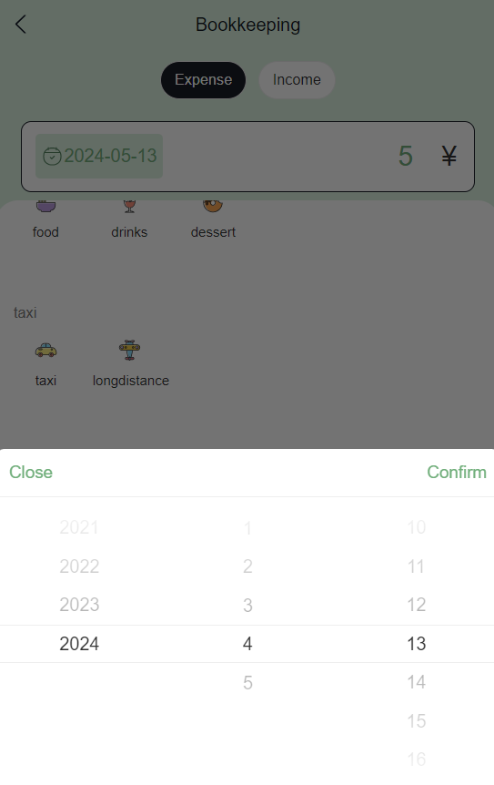
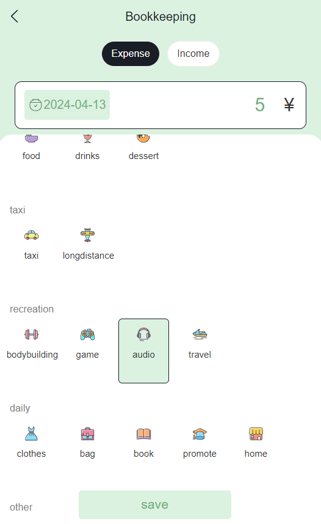
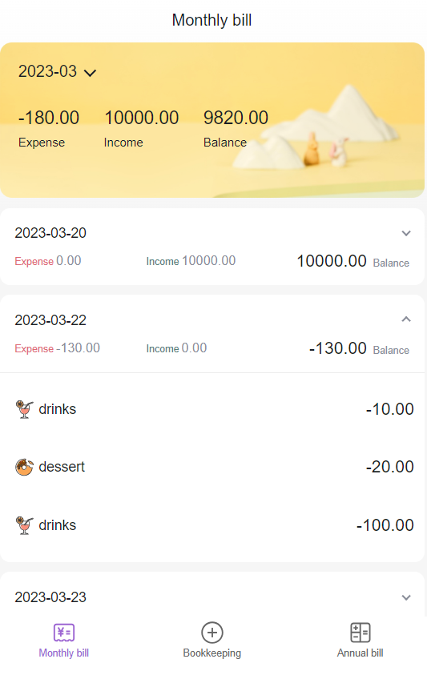
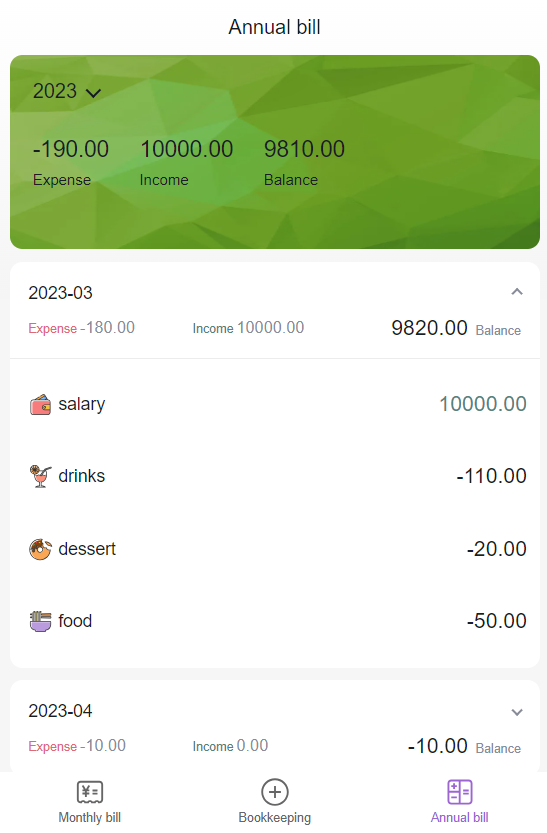

Here is a sample README markdown for your mobile app:

# Mobile App - Personal Finance Tracker

### Overview
This mobile app is built using React and allows users to track their personal finances in an organized manner. The app offers three main features:

1. **Bookkeeping**: Users can add and manage their expenses and income easily.
   
2. **Income and Expense Overview**: Users can view a summary of their income and expenses on a monthly or yearly basis.
   
3. **Detailed Expense Categories**: Users can categorize their expenses and income details, such as salary, food, drinks, etc.

### Features
- Easy bookkeeping interface
- Monthly and yearly overview of income and expenses
- Detailed breakdown of expense and income categories

### Setup
To run the app locally:
1. Clone this repository
2. Install dependencies using `npm install`
3. Run the app using `npm start`

### Technologies Used
- React
- CSS
- HTML

### Screenshots

